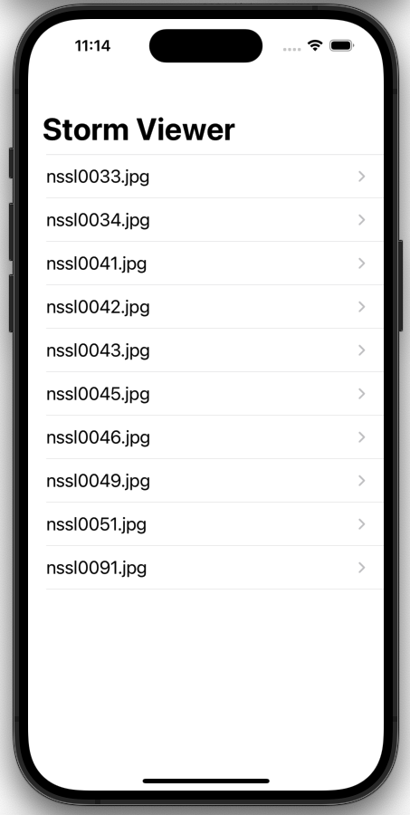
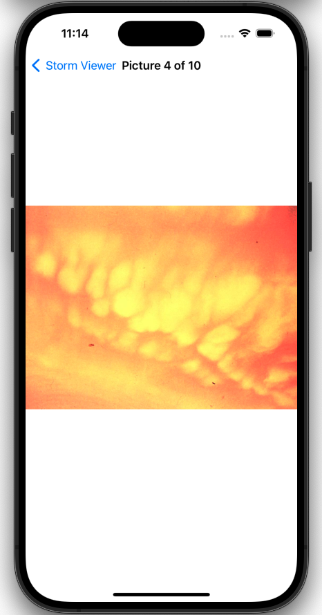

# Project 1 - Storm Viewer

This project involves developing an application that allows users to scroll through a list of images and select one to view.

https://www.hackingwithswift.com/100/16

## Topics

Table views and image views, app bundles, FileManager, typecasting, view controllers, storyboards, outlets, Auto Layout, UIImage, UIImageView, UINavigationBar.

## Challenges
From [Hacking with Swift](https://www.hackingwithswift.com/read/1/7/wrap-up):
>1. Use Interface Builder to select the text label inside your table view cell and adjust its font size to something larger – experiment and see what looks good.
>2. In your main table view, show the image names in sorted order, so “nssl0033.jpg” comes before “nssl0034.jpg”.
>3. Rather than show image names in the detail title bar, show “Picture X of Y”, where Y is the total number of images and X is the selected picture’s position in the array. Make sure you count from 1 rather than 0.

## Screenshots

  
   

