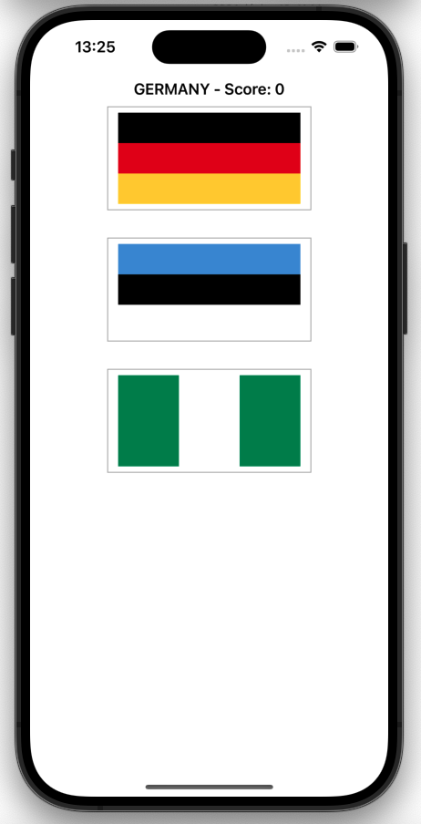
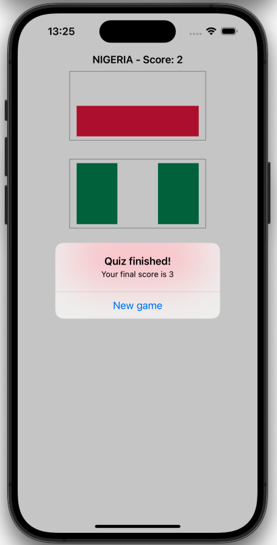

# Project 2 - Guess the Flag

This application is a flag quiz game where users are presented with random flags and asked to identify which flag belongs to a specific country.

https://www.hackingwithswift.com/100/19

## Topics

Interface Builder, Auto Layout, outlets, @2x and @3x images, asset catalogs, UIButton, CALayer, UIColor, random numbers, actions, UIAlertController.

## Challenges
From [Hacking with Swift](https://www.hackingwithswift.com/read/2/6/wrap-up):
>1. Try showing the player’s score in the navigation bar, alongside the flag to guess.
>2. Keep track of how many questions have been asked, and show one final alert controller after they have answered 10. This should show their final score.
>3. When someone chooses the wrong flag, tell them their mistake in your alert message – something like “Wrong! That’s the flag of France,” for example.

## Screenshots

  
   

