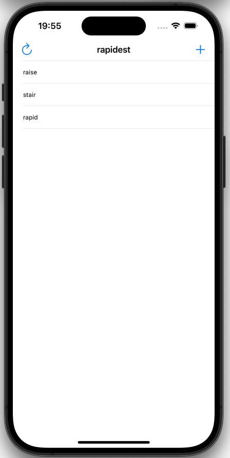

# Project 5 - Word Scramble

This app asks users to make anagrams out of a word, e.g. when given the word “anagrams” they might provide “rags”.

https://www.hackingwithswift.com/100/27

## Topics

Capture lists, UITextChecker, inserting table view rows with animation, Swift strings, closures, NSRange.

## Challenges
From [Hacking with Swift](https://www.hackingwithswift.com/read/5/7/wrap-up):
>1. Disallow answers that are shorter than three letters or are just our start word. For the three-letter check, the easiest thing to do is put a check into isReal() that returns false if the word length is under three letters. For the second part, just compare the start word against their input word and return false if they are the same.
>2. Refactor all the else statements we just added so that they call a new method called showErrorMessage(). This should accept an error message and a title, and do all the UIAlertController work from there.
>3. Add a left bar button item that calls startGame(), so users can restart with a new word whenever they want to.

## Screenshots

