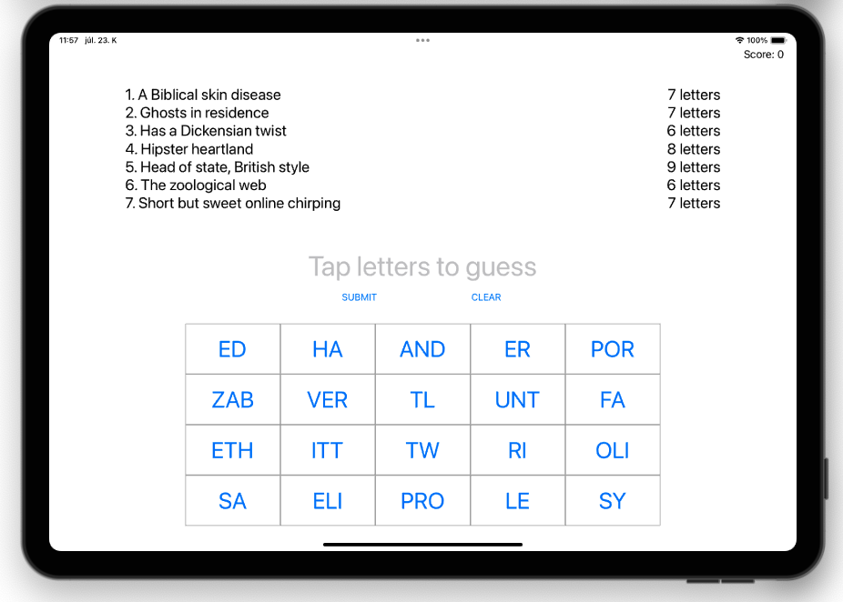

# Project 8 - Swifty Words

This is a word game based on the popular indie game 7 Little Words. Users are going to see a list of hints and an array of buttons with different letters on, and need to use those buttons to enter words matching the hints.

https://www.hackingwithswift.com/100/36

## Topics

text alignment, layout margins, UIFont, enumerated(), joined(), replacingOccurrences()

## Challenges
From [Hacking with Swift](https://www.hackingwithswift.com/read/8/6/wrap-up):
>1. Use the techniques you learned in project 2 to draw a thin gray line around the buttons view, to make it stand out from the rest of the UI.
>2. If the user enters an incorrect guess, show an alert telling them they are wrong. You’ll need to extend the submitTapped() method so that if firstIndex(of:) failed to find the guess you show the alert.
>3. Try making the game also deduct points if the player makes an incorrect guess. Think about how you can move to the next level – we can’t use a simple division remainder on the player’s score any more, because they might have lost some points.

## Screenshots

